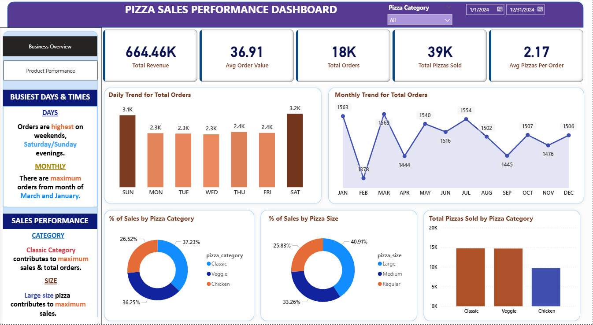
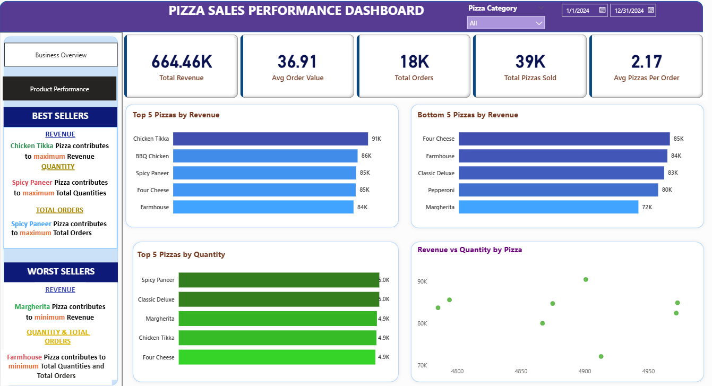

# 🍕 Pizza Sales Analysis — SQL & Power BI

## 📌 Project Overview

This project analyzes pizza sales data to understand overall sales performance, customer ordering patterns, product performance, and revenue contribution.

The analysis was performed using **SQL** for data analysis and **Power BI** for interactive dashboard visualization.

The goal of the project is to transform raw sales data into meaningful business insights that can support decisions related to product performance, sales trends, and business planning.

---

## 🎯 Business Questions

The project focuses on answering the following business questions:

1. What is the total revenue generated?
2. What is the average order value?
3. How many pizzas were sold?
4. How many orders were placed?
5. How many pizzas are sold per order on average?
6. Which days of the week generate the highest number of orders?
7. Which months have the highest order activity?
8. Which pizza categories contribute the most to total revenue?
9. Which pizza sizes contribute the most to total revenue?
10. Which pizzas are the top and bottom performers based on revenue?
11. Which pizzas are the top and bottom performers based on quantity sold?
12. Which pizzas receive the highest number of orders?

---

## 🛠️ Tools Used

* **SQL / MySQL** — Data analysis and business queries
* **Power BI** — Data visualization and dashboard creation
* **CSV** — Source dataset

---

## 🔍 SQL Analysis

SQL was used to calculate key performance indicators and analyze sales patterns.

### KPI Analysis

* Total Revenue
* Average Order Value
* Total Pizzas Sold
* Total Orders
* Average Pizzas Per Order

### Sales Trend Analysis

* Daily order trends by day of the week
* Monthly order trends

### Revenue Contribution Analysis

* Percentage of sales by pizza category
* Percentage of sales by pizza size

### Product Performance Analysis

* Top 5 pizzas by revenue
* Bottom 5 pizzas by revenue
* Top 5 pizzas by quantity sold
* Bottom 5 pizzas by quantity sold
* Top 5 pizzas by number of orders
* Bottom 5 pizzas by number of orders

The SQL queries used for the analysis are available in:

**`Pizza Sales.sql`**

---

## 📊 Power BI Dashboard

The Power BI dashboard converts the SQL analysis into an interactive visual report.

### Dashboard includes:

* Key sales KPIs
* Sales performance overview
* Daily and monthly order trends
* Product performance
* Pizza category analysis
* Pizza size analysis
* Top and bottom performing products
* Interactive navigation between dashboard pages

### Business Overview

### Product Performance

The Power BI report is available in:

**`Pizza Sales.pbix`**

---

## 💡 Key Insights

The analysis helps identify:

* Overall sales and order performance
* High- and low-performing pizza products
* Differences in revenue contribution across pizza categories
* Revenue contribution by pizza size
* Days and months with higher order activity
* Products that may require further business attention

---

## 📈 Business Recommendations

Based on the analysis, businesses can use the findings to:

* Focus marketing efforts on high-performing pizza categories and products.
* Review low-performing products to understand whether pricing, promotion, or product mix changes are required.
* Plan staffing and operational resources around periods with higher order activity.
* Use category and size performance to support menu and inventory decisions.
* Monitor product performance regularly to identify changes in customer demand.

---

## 📂 Project Files

| File               | Description                    |
| ------------------ | ------------------------------ |
| `Pizza Sales.csv`  | Raw pizza sales dataset        |
| `Pizza Sales.sql`  | SQL queries used for analysis  |
| `Pizza Sales.pbix` | Power BI interactive dashboard |

---

## 🎯 Project Objective

The objective of this project is to demonstrate how SQL can be used to analyze raw business data and how Power BI can transform the resulting analysis into an interactive business dashboard.

This project demonstrates practical skills in:

* SQL querying
* Aggregation and KPI calculation
* GROUP BY and filtering
* Date-based analysis
* Revenue contribution analysis
* Product performance analysis
* Business-oriented data visualization
* Dashboard development
